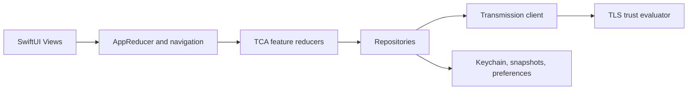

# Remission: Engineering Audit

Date: 2026-07-13

## Scope and baseline

This is a read-only engineering audit of the current working copy. It covers
architecture, TCA/SwiftUI, concurrency, network and security boundaries,
testing and delivery quality, and documentation.

- Branch: `feature/stage-5-transmission-cancellation-seam`
- Toolchain: Xcode 26.6 (17F113), Swift 6.3.3
- Working tree was not clean. The functional uncommitted changes are limited
  to `TorrentListReducer` polling state and its unit tests; they are discussed
  separately below.

## Executive summary

The application has a sound layered structure: SwiftUI views dispatch into TCA
reducers, reducers consume repositories/dependency clients, and repositories
isolate Transmission RPC, persistence, and caching. The server-scoped
`ServerConnectionEnvironment`, actor-backed Transmission session state,
explicit cancellation IDs, Keychain credentials, and deny-by-default TLS
prompt handling are strong foundations.

No P0 issue was found. The primary risks are an unimplemented HTTP-warning
policy which leaves Basic Authentication available over HTTP, and missing
repository-level CI. Documentation has drifted from the project settings and
active checkout path.

## Current architecture

- `AppReducer` owns the root `StackState` navigation path and routes server
  flows into `ServerDetailReducer`.
- `ServerConnectionEnvironment` builds server-specific Transmission,
  repository, cache, and trust dependencies rather than leaking one server's
  connection state into another.
- `TorrentListReducer` owns polling and uses cancellation IDs for fetch,
  polling, preference, cache, and command effects.
- `TransmissionClient` owns the HTTP 409 handshake, retry/backoff, RPC mode,
  and request session state. Its session/RPC stores are actors.

## Findings

### P1 — HTTP warning policy is not enforced

`HttpWarningPreferencesStore` exposes `isSuppressed` and `setSuppressed`, but
neither closure has a production call site. The store therefore cannot cause a
warning, acknowledgement, or connection block. At the same time, macOS enables
`NSAllowsArbitraryLoads`, and `TransmissionClient` attaches the `Authorization`
header whenever credentials exist.

Impact: a user-configured HTTP Transmission endpoint can receive Basic Auth
without the documented warning/acknowledgement flow. This is especially
important on shared or untrusted networks.

Evidence:

- `Remission/Storage/HttpWarningPreferencesStore.swift:7-11, 39-46`
- `Remission/Info-macOS.plist:30-34`
- `Remission/Network/Transmission/TransmissionClient.swift:762-769`
- No production references to `isSuppressed` or `setSuppressed` were found.

Recommended remediation:

1. Gate the first connect/probe of an HTTP server behind a reducer-owned
   confirmation state.
2. Permit the request only after explicit acknowledgement; persist suppression
   against the server fingerprint only when the user chooses it.
3. Add reducer and UI tests for first connect, suppression, changed endpoint,
   and credential-bearing HTTP configuration.

### P1 — no repository-level CI quality gate

The local pre-commit script runs format and lint checks, but `.github` is
ignored and no tracked GitHub Actions workflows are present. Consequently PRs
and release branches are not protected against skipped hooks, build failures,
or localization regressions.

Evidence:

- `.gitignore:75` ignores `.github`.
- No tracked `.github/` workflow or dependency-update configuration exists.

Recommended remediation:

1. Remove `.github` from ignore rules and commit workflows.
2. Require macOS build/test, `swift-format lint`, `swiftlint lint`, and
   `Scripts/check-localizations.sh` on pull requests.
3. Add iOS simulator test coverage when the CI runner has a healthy simulator
   runtime.

### P2 — documentation does not describe the checked-out build reality

README documents iOS 17 and macOS 14 as minimum targets, while all app and test
targets in `project.pbxproj` set deployment target 26.0. `AGENTS.md` and
`ProjectMap.md` also hard-code `/Users/plizkinzmey/SRC/Remission`, whereas this
checkout is under `/Volumes/Storage/SRC/Remission`.

Impact: contributors can select unsupported test destinations or run commands
against another checkout.

Recommended remediation: make all commands repository-relative, state 26.0 as
the current source of truth, and retain 17/14 only as an explicit future target
decision if that remains intended.

### P2 — large orchestration files need bounded ownership

The codebase already uses extension splits, but several core implementation
units remain large enough to increase review and regression risk:

| Unit | Lines |
| --- | ---: |
| `TransmissionClient.swift` | 832 |
| `TorrentListView.swift` | 630 |
| `TorrentListFeature+Reducer.swift` | 575 |
| `TorrentListFeature+Helpers.swift` | 408 |

Recommended remediation: preserve public interfaces but split RPC transport,
handshake/retry, and protocol-mode logic; extract Torrent-list presentation
sections and reduce helpers to narrowly owned operations. Add focused contract
tests before moving behavior.

### P2 — uncommitted polling state has no production consumer

The current working-copy diff adds `isPollingActive`, updates it in reducer
paths, and asserts it in unit tests. No production view, diagnostics surface,
or other reducer reads it. It therefore adds mutable implementation state
without currently changing observable behavior.

Recommended remediation: either consume the value in a defined product feature
(for example, diagnostics or a connection/polling indicator) with an
acceptance test, or remove it and test the existing externally visible polling
behavior instead.

### P3 — remaining hygiene

- SwiftLint reports two existing `closure_parameter_position` warnings in
  `ServerDetailView.swift`.
- No tracked `LICENSE` file was found; add one before public distribution.
- `@unchecked Sendable` wrappers are documented and mostly lock-backed, but
  should remain a review checklist and be replaced by actors only where that
  reduces, rather than spreads, isolation complexity.

## Validation

| Check | Result |
| --- | --- |
| `Scripts/check-localizations.sh` | Passed: 321 keys for `en` and `ru` |
| SwiftFormat lint | No diagnostics |
| SwiftLint | 2 non-serious warnings; cache write was denied by sandbox |
| macOS `xcodebuild test` | App and test bundles compiled; test runner failed to launch through LaunchServices |
| iOS simulator tests | Blocked: CoreSimulatorService was unavailable |
| `git diff --check` | Passed |

The macOS test failure was an environment launch failure, not a compile error
or test assertion. The full `xcodebuild` result bundle is external to the
repository and was not added to version control.

## Suggested order of work

1. Implement and test the HTTP acknowledgement gate.
2. Add CI and restore a reproducible macOS/iOS test runner environment.
3. Correct README, AGENTS, and ProjectMap paths/targets.
4. Decide the product purpose of `isPollingActive` before committing the
   current working-copy change.
5. Split the highest-churn orchestration files behind existing test seams.
