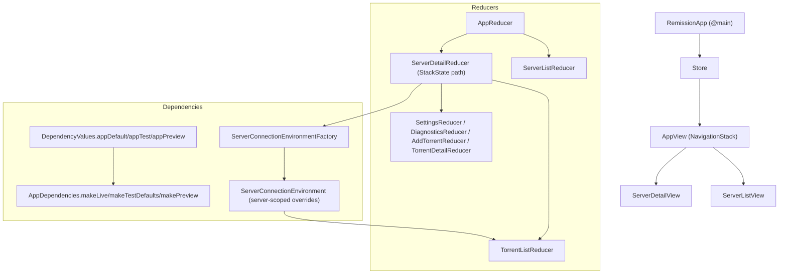

# Remission: Architecture Map

This is a deeper companion to `AGENTS.md`. It explains how major layers fit together and where to implement changes.

## High-Level Layers

- UI: SwiftUI views in `/Users/plizkinzmey/SRC/Remission/Remission/Views/`
- State & effects: TCA reducers in `/Users/plizkinzmey/SRC/Remission/Remission/Features/` + root `/Users/plizkinzmey/SRC/Remission/Remission/App/AppFeature.swift`
- Domain: models + mapping in `/Users/plizkinzmey/SRC/Remission/Remission/Domain/`
- Network: Transmission RPC client in `/Users/plizkinzmey/SRC/Remission/Remission/Network/Transmission/`
- Storage & security:
  - server list: `/Users/plizkinzmey/SRC/Remission/Remission/Repositories/ServerConfigRepository.swift`
  - credentials: `/Users/plizkinzmey/SRC/Remission/Remission/Storage/KeychainCredentialsStore.swift`
  - trust: `/Users/plizkinzmey/SRC/Remission/Remission/Security/Trust/`
  - offline snapshots: `/Users/plizkinzmey/SRC/Remission/Remission/Storage/ServerSnapshotCache.swift`
- Observability:
  - app logger: `/Users/plizkinzmey/SRC/Remission/Remission/DependencyClients/AppLogger.swift`
  - RPC logger: `/Users/plizkinzmey/SRC/Remission/Remission/Logging/TransmissionLogger.swift`
  - diagnostics: `/Users/plizkinzmey/SRC/Remission/Remission/Features/Diagnostics/DiagnosticsFeature.swift`

## App Wiring Diagram

## Server-Scoped Dependency Context

The key pattern in this app is that most server operations run inside a per-server dependency context.

- Environment type: `/Users/plizkinzmey/SRC/Remission/Remission/App/ServerConnectionEnvironment.swift`
  - Holds:
    - `TransmissionClientDependency`
    - `TorrentRepository`
    - `SessionRepository`
    - offline cache key + client
  - Can apply overrides to `DependencyValues` and run an operation via `withDependencies { ... }`.
- Factory: `ServerConnectionEnvironmentFactory.liveValue`
  - Loads password (if configured) from `CredentialsRepository`.
  - Builds `TransmissionClient` + trust handler.
  - Creates repositories using `TransmissionDomainMapper` and offline snapshot client.

This makes it easy to:
- isolate unit tests (build an environment with in-memory repositories),
- support multiple servers simultaneously, and
- evolve the repository layer without rewriting reducer code.

## Transmission RPC Notes

- Request/response are *Transmission RPC* (not JSON-RPC 2.0):
  - `/Users/plizkinzmey/SRC/Remission/Remission/Network/Transmission/TransmissionRequest.swift`
  - `/Users/plizkinzmey/SRC/Remission/Remission/Network/Transmission/TransmissionResponse.swift`
- `TransmissionClient` implements:
  - Basic auth headers
  - 409 handshake (`X-Transmission-Session-Id`)
  - retry/backoff (clock-injected)
  - TLS trust evaluation integration
  - safe logging (masked headers)
  - `/Users/plizkinzmey/SRC/Remission/Remission/Network/Transmission/TransmissionClient.swift`

## Persistence Model

- `ServerConfigRepository` persists `servers.json` (no password).
- Passwords are stored separately in Keychain.
- Offline cache stores snapshots (torrents + session) keyed by:
  - server ID
  - a fingerprint of connection parameters
  - RPC version (can influence mapping)

## ATS & HTTP (Rationale)

Remission supports user-configured server endpoints, including HTTP.

- **macOS**: `Remission/Info-macOS.plist` sets `NSAppTransportSecurity.NSAllowsArbitraryLoads = true`.
  - Rationale: the host list is dynamic (configured by the user), so a static allowlist is not practical.
  - UX: the app shows an HTTP warning and lets users acknowledge it:
    - Store: `Remission/Storage/HttpWarningPreferencesStore.swift`
- **iOS**: there are no ATS exceptions in `Remission/Info-iOS.plist`.
  - Implication: plain HTTP to remote hosts may be blocked by ATS depending on OS rules and network context.
  - We treat this as an intentional constraint until we decide on an iOS strategy (e.g. dropping HTTP, or adding scoped exceptions).
## Testing Strategy (What Is Idiomatic Here)

- Prefer TCA `TestStore` with dependency overrides.
- Factory helper:
  - `/Users/plizkinzmey/SRC/Remission/RemissionTests/Support/TestStoreFactory.swift`
- For network-level assertions, use `MockURLProtocol`:
  - `/Users/plizkinzmey/SRC/Remission/RemissionTests/Support/MockURLProtocol.swift`
- UI tests can force deterministic startup state via `AppBootstrap` launch args:
  - `/Users/plizkinzmey/SRC/Remission/Remission/App/AppBootstrap.swift`

## Extending The App (Decision Points)

When adding a feature, decide which reducer owns it:
- App-wide: wire through `AppReducer` and navigation path.
- Server-scoped: wire through `ServerDetailReducer` and/or `TorrentListReducer`.
- Pure view/UI-only: put in `Views/Shared` first, then lift into a reducer if it needs state/effects.

When adding a dependency:
1. Add a dependency key/client in `Remission/DependencyClients/`.
2. Add live implementation in `Remission/DependencyClientLive/` (only if needed; some deps are live in the client itself).
3. Decide default values in `DependencyValues+App.swift` and set them in `AppDependencies.*` if the dependency differs by environment.
